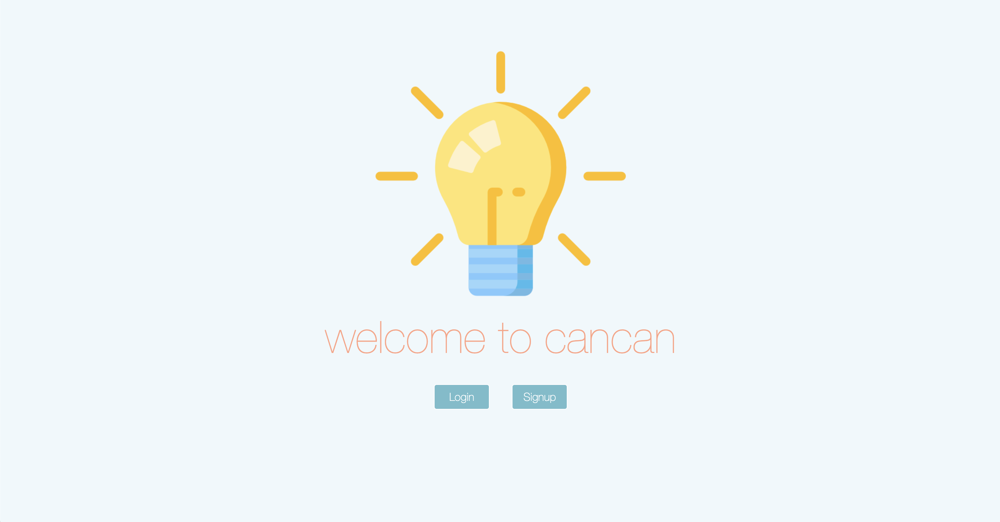
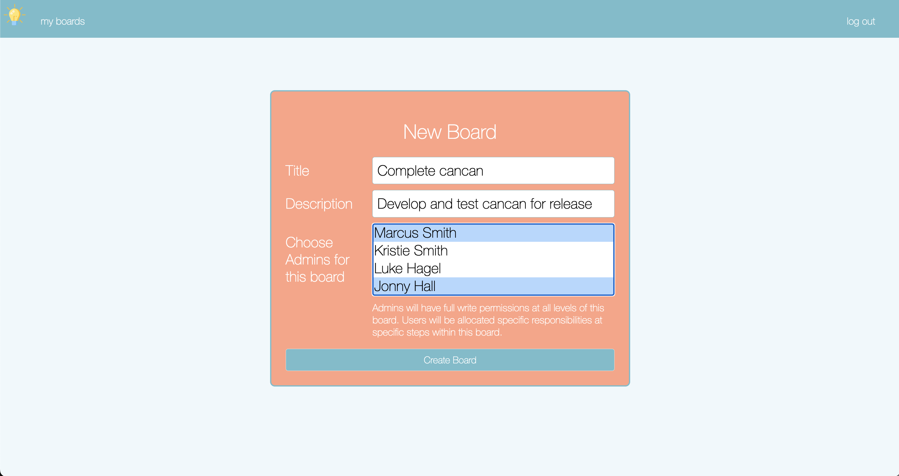
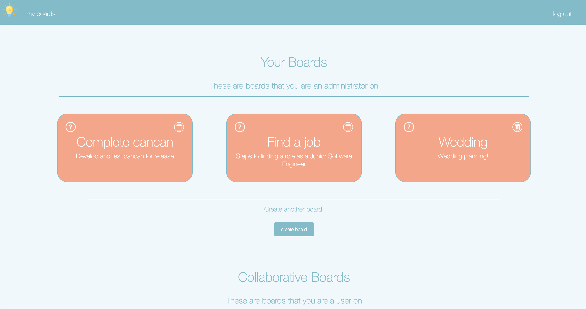
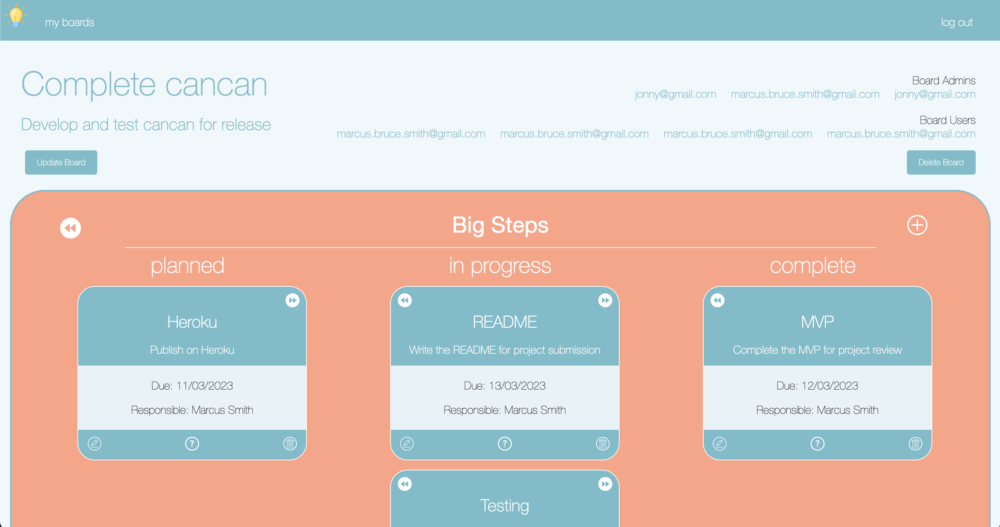
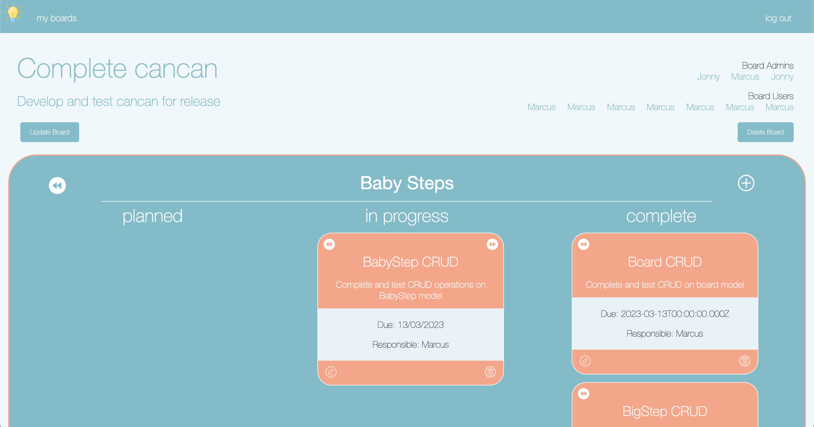

# cancan.io - the projects app

## Introduction
cancan is a kanban-based tool to track the progress of projects. Each board has within it an unlimited number of 'big steps', within which there are an unlimited number of 'baby steps'.

As a user, you can track your big and baby step progress with your teammates, assigning responsibility of project stages.

  
  

### Screenshots
Welcome

  
New Board

  
My Boards

  
Board Detail - Big Steps

  
Board Detail - Baby Steps

  
  

## Technologies Used
During this project I used the MERN Stack:
 * MongoDB/Mongoose
 * Express
 * React.js
 * Node.js

  
  

## Getting Started
Find planning documents below:
 * [Planning Materials](https://docs.google.com/document/d/1qlpGrrd2ngbnR7gZY-alhr5ifHr5hTlYXAbCOV9TGVs/edit#) 
 * [Trello](https://trello.com/b/W6WazhrX/project-4) 
 * [Deployed App](https://cancan.herokuapp.com/) 

  
  

## Unsolved Problems:
 * Admin array does not check for duplicates
 * Although CRUD operations are restricted on the back-end, there is no front-end authorisation
 * Date selectors return the day prior to selected date
 * The site is not responsive

  
  

## Future Enhancements:
 * Resolve unsolved problems
 * Improve UI and styling
 * Build out the logic in the model virtuals to show a more accurate picture of completeness
 * Implement front-end authorizations
 * Improve the back-end authorizations for additional flexibility
 * Sort tasks by due date
 * Add a dashboard that shows impending tasks - include functionality like identifying quick wins
 * Add a calendar of upcoming deadlines

